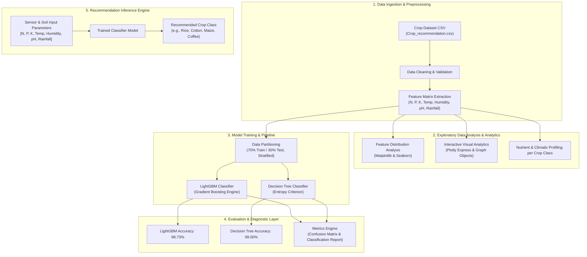
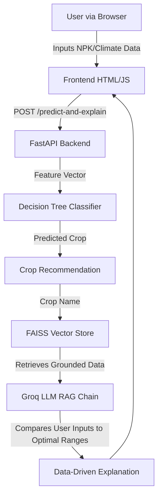

---

## 📌 Table of Contents

- [Overview](#-overview)
- [System Architecture](#-system-architecture)
- [Dataset Overview](#-dataset-overview)
- [Project Workflow](#-project-workflow)
- [Machine Learning Models & Performance](#-machine-learning-models--performance)
- [Installation & Setup](#-installation--setup)

---

## 📐 System Architecture

The high-level architecture of the Crop Recommendation System consists of five core layers: Data Ingestion & Preprocessing, Exploratory Data Analysis (EDA), Machine Learning & Model Training, Diagnostic Evaluation, and the Inference Engine.

### Architecture Diagram (Mermaid)



### System Flow (ASCII Representation)

```
+-----------------------------------------------------------------------------------+
|                            INPUT PARAMETERS                                       |
| [ Nitrogen (N) | Phosphorus (P) | Potassium (K) | Temp | Humidity | pH | Rainfall ] |
+-----------------------------------------------------------------------------------+
                                         |
                                         v
+-----------------------------------------------------------------------------------+
|                        DATA PREPROCESSING & EDA                                  |
|  - Correlation Heatmaps & Feature Distributions (Seaborn & Plotly)                 |
|  - Feature Normalization & 70/30 Train-Test Train Split                           |
+-----------------------------------------------------------------------------------+
                                         |
                                         v
+-----------------------------------------------------------------------------------+
|                        MACHINE LEARNING ENGINE                                    |
|   +----------------------------------+   +------------------------------------+   |
|   | LightGBM Classifier (Acc: 98.73%)|   | Decision Tree Classifier (99.00%)  |   |
|   +----------------------------------+   +------------------------------------+   |
+-----------------------------------------------------------------------------------+
                                         |
                                         v
+-----------------------------------------------------------------------------------+
|                        PREDICTION & RECOMMENDATION                                |
|             Target Crop Class Identified (22 Crop Types Supported)               |
+-----------------------------------------------------------------------------------+
```

---

## 📊 Dataset Overview

The system utilizes the **Crop Recommendation Dataset** containing **2,200 records** across **22 distinct crop categories** (100 samples per crop type).

### Input Features

| Feature Name | Description | Range / Unit |
| :--- | :--- | :--- |
| **`N`** | Ratio of Nitrogen content in soil | 0 - 140 (kg/ha) |
| **`P`** | Ratio of Phosphorus content in soil | 5 - 145 (kg/ha) |
| **`K`** | Ratio of Potassium content in soil | 5 - 205 (kg/ha) |
| **`temperature`** | Ambient temperature | 8.8°C - 43.7°C |
| **`humidity`** | Relative humidity in the air | 14.3% - 99.9% |
| **`ph`** | Acidic/alkaline pH value of soil | 3.5 - 9.9 |
| **`rainfall`** | Annual / seasonal rainfall | 20.2 mm - 298.6 mm |

### Target Classes (22 Crops)
- **Cereals & Grains:** `rice`, `maize`
- **Pulses & Legumes:** `chickpea`, `kidneybeans`, `pigeonpeas`, `mothbeans`, `mungbean`, `blackgram`, `lentil`
- **Fruits:** `pomegranate`, `banana`, `mango`, `grapes`, `watermelon`, `muskmelon`, `apple`, `orange`, `papaya`
- **Cash / Commercial Crops:** `coconut`, `cotton`, `jute`, `coffee`

---

## 🔄 Project Workflow

1. **Exploratory Data Analysis (EDA):**
   - Summary statistics & missing value checks.
   - Correlation analysis between soil nutrients and environmental factors.
   - Visualizing crop-wise feature distributions using Matplotlib, Seaborn, and interactive Plotly subplots.
2. **Data Partitioning:**
   - Stratified dataset partitioning with a 70% Training set (1,547 samples) and 30% Test set (653 samples).
3. **Model Selection & Training:**
   - Implementation of ensemble gradient boosting via **LightGBM**.
   - Implementation of supervised decision rules via **Decision Tree Classifier** (`entropy` criterion).
4. **Evaluation & Performance Diagnostics:**
   - Calculation of Accuracy Score, Confusion Matrix, and detailed Classification Reports (Precision, Recall, F1-Score).
5. **Inference Pipeline:**
   - Predicting optimal crop based on arbitrary soil nutrient and climate inputs.

---

## 🏆 Machine Learning Models & Performance

Both evaluated models achieved high precision and recall on the test dataset:

| Model Algorithm | Split Ratio | Accuracy Score | Key Highlights |
| :--- | :---: | :---: | :--- |
| **Decision Tree Classifier** | 70 / 30 | **99.00%** | Exceptional performance using Information Gain (Entropy). |
| **LightGBM Classifier** | 70 / 30 | **98.73%** | Fast, high-density tree-based ensemble boosting model. |

### Classification Report Summary (Sample Crop Performance)

| Crop Class | Precision | Recall | F1-Score |
| :--- | :---: | :---: | :---: |
| **Rice** | 0.85 | 0.85 | 0.85 |
| **Maize** | 0.96 | 1.00 | 0.98 |
| **Cotton** | 1.00 | 1.00 | 1.00 |
| **Banana** | 1.00 | 1.00 | 1.00 |
| **Chickpea** | 1.00 | 1.00 | 1.00 |
| **Macro Average** | **0.98** | **0.98** | **0.98** |
| **Weighted Average** | **0.99** | **0.99** | **0.99** |

---

## ⚡ Installation & Setup

### 1. Prerequisites
Ensure you have Python 3.8+ installed on your system.

### 2. Clone / Extract Repository
```bash
git clone https://github.com/falguneeshrma/Crop-Recommendation-System.git
cd Crop-Recommendation-System
```

### 3. Install Required Libraries
Install all required dependencies using `pip`:

```bash
pip install pandas numpy matplotlib seaborn plotly scikit-learn lightgbm jupyter
```

---

# Krishi Sahayak

AI-powered crop recommendation and agricultural advisory system that combines soil and climate data with machine learning and AI-powered explanations.

## Project Overview

Krishi Sahayak (Agricultural Assistant) is an intelligent decision-support system for farmers and agronomists. It solves the "black box" problem of traditional machine learning recommendations by not only predicting the most suitable crop for a given parcel of land, but also explaining *why* that crop was chosen using grounded agricultural data. Users input their local soil chemistry and climate conditions, and the system provides a data-driven recommendation alongside an interactive AI assistant for follow-up questions.

## Key Features

- **AI-assisted crop recommendation**: Predicts the best crop from 22 modeled varieties.
- **Soil and climate based prediction**: Uses 7 specific environmental inputs (N, P, K, Temperature, Humidity, pH, Rainfall).
- **Model confidence**: Displays the prediction probability of the underlying ML model.
- **Numeric explanation of crop suitability**: Compares user inputs directly against known optimal numeric ranges for the predicted crop.
- **Agricultural AI assistant**: A built-in chat interface to ask follow-up questions about fertilizers, irrigation, and pests, grounded in agricultural documentation.
- **FastAPI backend**: A fast, asynchronous backend serving both the API and the web interface.
- **Interactive web interface**: A clean, responsive, single-page application built with HTML, CSS, and JavaScript.

## System Architecture



## Tech Stack

**Frontend:**
- HTML5
- CSS3 (Vanilla)
- JavaScript (Vanilla)

**Backend:**
- Python 3
- FastAPI
- Uvicorn (ASGI server)

**Machine Learning & Data:**
- scikit-learn (DecisionTreeClassifier)
- pandas
- joblib

**AI & Natural Language:**
- LangChain
- Groq (LLM Inference - `openai/gpt-oss-120b` via Groq)
- FAISS (Vector Store)
- HuggingFace Embeddings (`all-MiniLM-L6-v2`)

## Project Structure

```text
Krishi-Sahayak/
├── app/
│   ├── main.py                  # FastAPI application entry point
│   └── static/
│       ├── index.html           # Main web interface
│       ├── script.js            # Frontend logic
│       └── style.css            # Frontend styling
├── data/
│   ├── build_knowledge_base.py  # Script to generate markdown knowledge base
│   ├── crop_stats.json          # Numeric boundary thresholds for crops
│   └── knowledge_base/          # Markdown files for RAG context
├── models/
│   ├── crop_model.joblib        # Trained scikit-learn model
│   └── metadata.json            # Model metadata
├── vectorstore/
│   └── faiss_index/             # Pre-built FAISS vector database
├── .env                         # Local environment variables (do not commit)
├── .gitignore
├── ingest.py                    # Script to build FAISS index from knowledge base
├── rag_chain.py                 # Core logic for LangChain RAG and comparisons
├── README.md                    # Project documentation
├── requirements.txt             # Python dependencies
└── train_model.py               # Script to retrain the ML model
```

## Installation

1. **Clone the repository**
   ```powershell
   git clone <repository-url>
   cd Krishi-Sahayak
   ```

2. **Create a virtual environment**
   ```powershell
   python -m venv .venv
   ```

3. **Activate the virtual environment**
   ```powershell
   .\.venv\Scripts\Activate.ps1
   ```

4. **Install dependencies**
   ```powershell
   pip install -r requirements.txt
   ```

## Environment Variables

The system requires a Groq API key for the AI assistant and explanation generation to function.

1. Create a `.env` file in the root of the project.
2. Add your Groq API key:
   ```env
   GROQ_API_KEY=your_groq_api_key_here
   ```

> [!WARNING]
> Ensure your `.env` file is never committed to version control. It is already included in `.gitignore`.

## Running the Application

Start the FastAPI application using `uvicorn`:

```powershell
uvicorn app.main:app --reload --port 8000
```

Once running, access the web interface by navigating to `http://localhost:8000` in your browser. The frontend is served directly by the FastAPI app.

## API Endpoints

### `GET /health`
- **Purpose**: Check if the API is running.
- **Request Body**: None
- **Response**: `{"status": "ok"}`

### `POST /predict`
- **Purpose**: Get a raw crop prediction based on soil and climate conditions.
- **Request Body**:
  ```json
  {
    "N": 90,
    "P": 42,
    "K": 43,
    "temperature": 24.5,
    "humidity": 82,
    "ph": 6.5,
    "rainfall": 220
  }
  ```
- **Response Structure**:
  ```json
  {
    "crop": "rice",
    "confidence": 1.0
  }
  ```

### `POST /predict-and-explain`
- **Purpose**: Get a crop prediction alongside an AI-generated explanation that strictly compares the user's input values against the crop's ideal thresholds.
- **Request Body**: Same as `/predict`
- **Response Structure**:
  ```json
  {
    "crop": "rice",
    "confidence": 1.0,
    "explanation": "Why this crop?\n\nPredicted crop: Rice\n\nYour conditions compared with Rice's requirements:..."
  }
  ```

### `POST /ask`
- **Purpose**: Chat with the agricultural assistant regarding irrigation, fertilizers, pests, etc.
- **Request Body**:
  ```json
  {
    "question": "How often should I irrigate this crop?",
    "crop": "rice"
  }
  ```
- **Response Structure**:
  ```json
  {
    "answer": "...",
    "sources": ["rice"]
  }
  ```
  *(Note: `crop` is an optional field)*

## Limitations

- **External Dependency**: Generating explanations and answering follow-up questions requires a valid internet connection and an active Groq API key.
- **Static Dataset Context**: The knowledge base is currently built from static markdown files and local numeric threshold ranges.
- **Predictive Model**: The current ML model is a basic Decision Tree Classifier. While highly interpretable, it may not generalize to unseen edge cases perfectly.
- **Decision Support Only**: This system should be treated as a decision-support tool. Final agricultural decisions should always consider ground truth and professional agronomist advice.

## Future Improvements

- [Planned] Swap the Decision Tree for Random Forest or XGBoost to improve accuracy on edge cases.
- [Planned] Add chat memory (session state) so the AI assistant can remember previous questions and contextualize follow-ups naturally.
- [Planned] Containerize the application using Docker for easier deployment.
