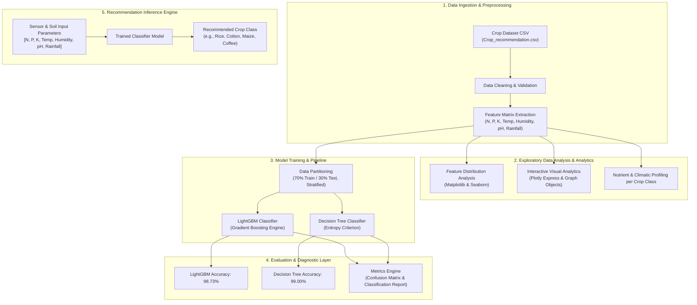

# 🌾 Smart Crop Recommendation System


An end-to-end Machine Learning based **Crop Recommendation System** designed to assist farmers and agricultural scientists in making data-driven decisions. By analyzing key soil nutrient levels (**Nitrogen, Phosphorus, Potassium**) alongside environmental conditions (**Temperature, Humidity, pH, and Rainfall**), the system predicts the most suitable crop to cultivate for maximum agricultural yield.

---

## 📌 Table of Contents

- [Overview](#-overview)
- [System Architecture](#-system-architecture)
- [Dataset Overview](#-dataset-overview)
- [Project Workflow](#-project-workflow)
- [Machine Learning Models & Performance](#-machine-learning-models--performance)
- [Directory Structure](#-directory-structure)
- [Installation & Setup](#-installation--setup)
- [Usage & Sample Prediction](#-usage--sample-prediction)
- [Future Roadmap](#-future-roadmap)
- [License](#-license)

---

## 📐 System Architecture

The high-level architecture of the Crop Recommendation System consists of five core layers: Data Ingestion & Preprocessing, Exploratory Data Analysis (EDA), Machine Learning & Model Training, Diagnostic Evaluation, and the Inference Engine.

### Architecture Diagram (Mermaid)



### System Flow (ASCII Representation)

```
+-----------------------------------------------------------------------------------+
|                            INPUT PARAMETERS                                       |
| [ Nitrogen (N) | Phosphorus (P) | Potassium (K) | Temp | Humidity | pH | Rainfall ] |
+-----------------------------------------------------------------------------------+
                                         |
                                         v
+-----------------------------------------------------------------------------------+
|                        DATA PREPROCESSING & EDA                                  |
|  - Correlation Heatmaps & Feature Distributions (Seaborn & Plotly)                 |
|  - Feature Normalization & 70/30 Train-Test Train Split                           |
+-----------------------------------------------------------------------------------+
                                         |
                                         v
+-----------------------------------------------------------------------------------+
|                        MACHINE LEARNING ENGINE                                    |
|   +----------------------------------+   +------------------------------------+   |
|   | LightGBM Classifier (Acc: 98.73%)|   | Decision Tree Classifier (99.00%)  |   |
|   +----------------------------------+   +------------------------------------+   |
+-----------------------------------------------------------------------------------+
                                         |
                                         v
+-----------------------------------------------------------------------------------+
|                        PREDICTION & RECOMMENDATION                                |
|             Target Crop Class Identified (22 Crop Types Supported)               |
+-----------------------------------------------------------------------------------+
```

---

## 📊 Dataset Overview

The system utilizes the **Crop Recommendation Dataset** containing **2,200 records** across **22 distinct crop categories** (100 samples per crop type).

### Input Features

| Feature Name | Description | Range / Unit |
| :--- | :--- | :--- |
| **`N`** | Ratio of Nitrogen content in soil | 0 - 140 (kg/ha) |
| **`P`** | Ratio of Phosphorus content in soil | 5 - 145 (kg/ha) |
| **`K`** | Ratio of Potassium content in soil | 5 - 205 (kg/ha) |
| **`temperature`** | Ambient temperature | 8.8°C - 43.7°C |
| **`humidity`** | Relative humidity in the air | 14.3% - 99.9% |
| **`ph`** | Acidic/alkaline pH value of soil | 3.5 - 9.9 |
| **`rainfall`** | Annual / seasonal rainfall | 20.2 mm - 298.6 mm |

### Target Classes (22 Crops)
- **Cereals & Grains:** `rice`, `maize`
- **Pulses & Legumes:** `chickpea`, `kidneybeans`, `pigeonpeas`, `mothbeans`, `mungbean`, `blackgram`, `lentil`
- **Fruits:** `pomegranate`, `banana`, `mango`, `grapes`, `watermelon`, `muskmelon`, `apple`, `orange`, `papaya`
- **Cash / Commercial Crops:** `coconut`, `cotton`, `jute`, `coffee`

---

## 🔄 Project Workflow

1. **Exploratory Data Analysis (EDA):**
   - Summary statistics & missing value checks.
   - Correlation analysis between soil nutrients and environmental factors.
   - Visualizing crop-wise feature distributions using Matplotlib, Seaborn, and interactive Plotly subplots.
2. **Data Partitioning:**
   - Stratified dataset partitioning with a 70% Training set (1,547 samples) and 30% Test set (653 samples).
3. **Model Selection & Training:**
   - Implementation of ensemble gradient boosting via **LightGBM**.
   - Implementation of supervised decision rules via **Decision Tree Classifier** (`entropy` criterion).
4. **Evaluation & Performance Diagnostics:**
   - Calculation of Accuracy Score, Confusion Matrix, and detailed Classification Reports (Precision, Recall, F1-Score).
5. **Inference Pipeline:**
   - Predicting optimal crop based on arbitrary soil nutrient and climate inputs.

---

## 🏆 Machine Learning Models & Performance

Both evaluated models achieved high precision and recall on the test dataset:

| Model Algorithm | Split Ratio | Accuracy Score | Key Highlights |
| :--- | :---: | :---: | :--- |
| **Decision Tree Classifier** | 70 / 30 | **99.00%** | Exceptional performance using Information Gain (Entropy). |
| **LightGBM Classifier** | 70 / 30 | **98.73%** | Fast, high-density tree-based ensemble boosting model. |

### Classification Report Summary (Sample Crop Performance)

| Crop Class | Precision | Recall | F1-Score |
| :--- | :---: | :---: | :---: |
| **Rice** | 0.85 | 0.85 | 0.85 |
| **Maize** | 0.96 | 1.00 | 0.98 |
| **Cotton** | 1.00 | 1.00 | 1.00 |
| **Banana** | 1.00 | 1.00 | 1.00 |
| **Chickpea** | 1.00 | 1.00 | 1.00 |
| **Macro Average** | **0.98** | **0.98** | **0.98** |
| **Weighted Average** | **0.99** | **0.99** | **0.99** |

---

## 📁 Directory Structure

```
Crop management system/
│
├── Crop_recommendation.csv         # Complete dataset (2200 rows, 8 columns)
├── CropRecommendationSystemm.ipynb # Jupyter Notebook with EDA, visualizations & ML training
└── README.md                       # Comprehensive project documentation & architecture
```

---

## ⚡ Installation & Setup

### 1. Prerequisites
Ensure you have Python 3.8+ installed on your system.

### 2. Clone / Extract Repository
```bash
git clone https://github.com/falguneeshrma/Crop-Recommendation-System.git
cd Crop-Recommendation-System
```

### 3. Install Required Libraries
Install all required dependencies using `pip`:

```bash
pip install pandas numpy matplotlib seaborn plotly scikit-learn lightgbm jupyter
```

---

## 💡 Usage & Sample Prediction

### Running via Jupyter Notebook
Launch the notebook to inspect interactive visualizations and run model evaluations:

```bash
jupyter notebook CropRecommendationSystemm.ipynb
```

### Python Code Snippet for Single Sample Prediction

```python
import pandas as pd
from sklearn.model_selection import train_test_split
from sklearn.tree import DecisionTreeClassifier

# 1. Load dataset
data = pd.read_csv('Crop_recommendation.csv')
X = data[['N', 'P', 'K', 'temperature', 'humidity', 'ph', 'rainfall']]
y = data['label']

# 2. Train Model
X_train, X_test, y_train, y_test = train_test_split(X, y, test_size=0.30, random_state=0, shuffle=True)
clf = DecisionTreeClassifier(criterion='entropy', random_state=0)
clf.fit(X_train, y_train)

# 3. Custom Input Prediction: [N, P, K, temp, humidity, pH, rainfall]
sample_input = [[119, 44, 15, 22.14, 82.85, 7.09, 60.65]]
predicted_crop = clf.predict(sample_input)

print(f"🌾 Recommended Crop: {predicted_crop[0].capitalize()}")
# Output: 🌾 Recommended Crop: Cotton
```

---

## 🚀 Future Roadmap

- [ ] **Web Application Integration:** Build an interactive frontend using Flask / Streamlit for real-time farmer inputs.
- [ ] **IoT Sensor Integration:** Connect real-time soil moisture, NPK sensors, and weather APIs.
- [ ] **Fertilizer Recommendation:** Extend prediction engine to recommend optimal fertilizer dosage based on nutrient deficits.
- [ ] **REST API Deployment:** Package the model into Docker container and serve predictions via FastAPI.

---

## 📜 License

Distributed under the MIT License. See `LICENSE` for more details.
